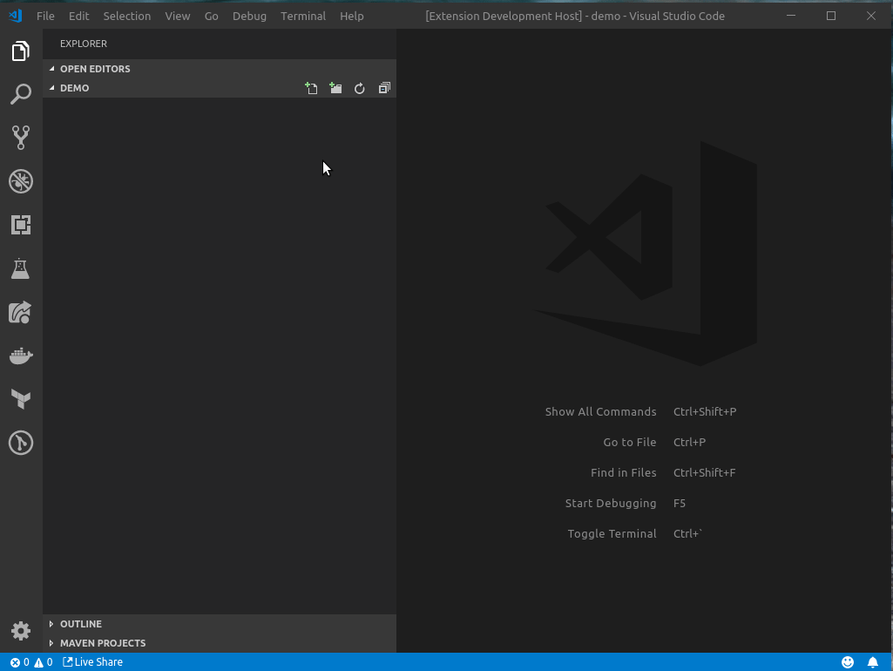

# VSC Working Directory Greeter Extension

Provides a command 'Working Directory Greeter' to print your working directory in an information message (a notification bubble thingy).

## Features

Open the VSC Command Pallet and search for a command "Working Directory Greeter" to get a notification showing your current working directory.

## Release Notes

Pre-release dev prototype fun times!

**Enjoy!**
